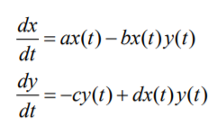
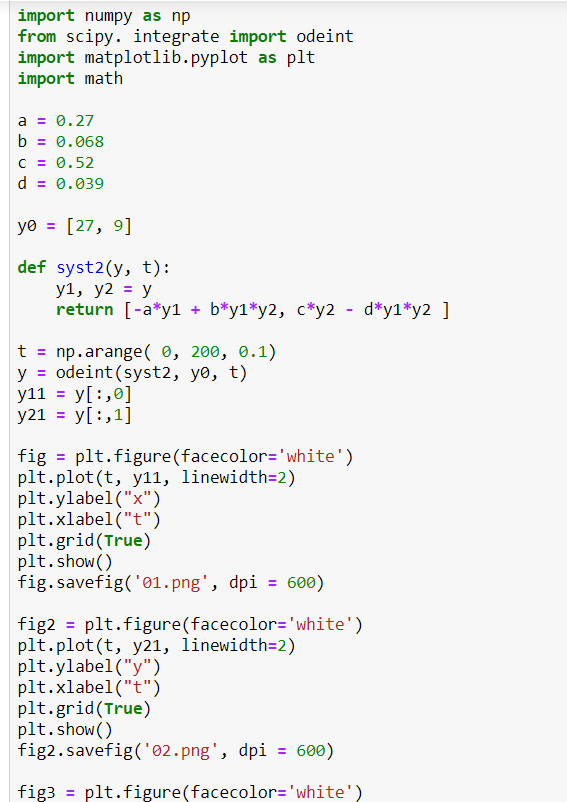
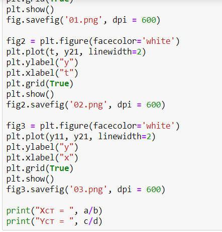
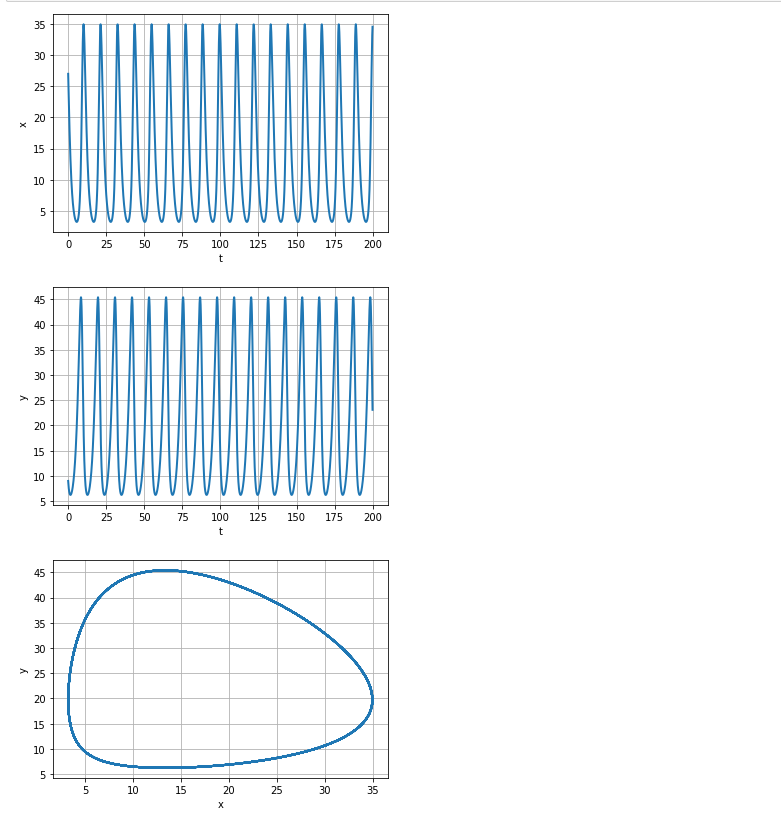

---
## Front matter
lang: ru-RU
title: Модель жертва-хищник
author:  Миличевич Александра, НПИ 02-18
	
	
date: 13 March, 2021 Moscow, Russia

## Formatting
toc: false
slide_level: 2
theme: metropolis
header-includes: 
 - '\metroset{progressbar=frametitle,sectionpage=progressbar,numbering=fraction}'
 - '\makeatletter'
 - '\beamer@ignorenonframefalse'
 - '\makeatother'
aspectratio: 43
section-titles: true
---
# Цель работы
Изучить модель жертва-хищник и построить графики и найти стационарное состояние системы

# Модель хищник-жертва 

Формула на чей основе строим модель жертва-хищник (рис. -@fig:001).

{ #fig:001 width=70% }

В этой модели x – число жертв, y - число хищников. Коэффициент a
описывает скорость естественного прироста числа жертв в отсутствие хищников, с
- естественное вымирание хищников, лишенных пищи в виде жертв. Вероятность
взаимодействия жертвы и хищника считается пропорциональной как количеству
жертв, так и числу самих хищников (xy). Каждый акт взаимодействия уменьшает
популяцию жертв, но способствует увеличению популяции хищников (члены -bxy
и dxy в правой части уравнения).

# Прогамма

(рис. -@fig:002).

{ #fig:002 width=70% }

 (рис. -@fig:003).

{ #fig:003 width=70% }

# Графики

Графики(рис. -@fig:003).

{ #fig:003 width=70% }

# Вывод

выучила как построить граф изменения численности популяции жертв x и хищников и е 

 и график зависимости изменения численности хищников от изменения численности жертв

## {.standout}

Спасибо за внимание 

