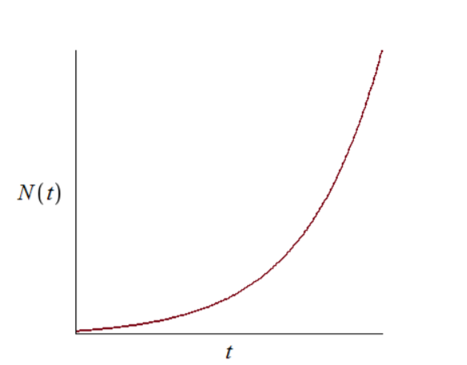
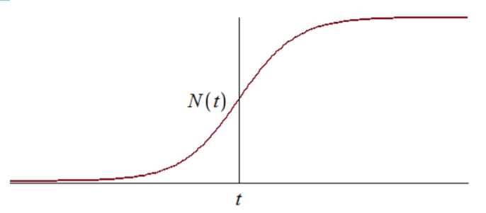
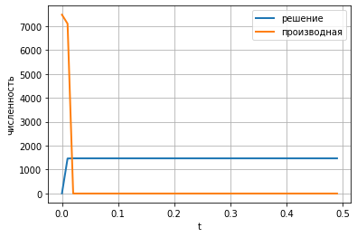
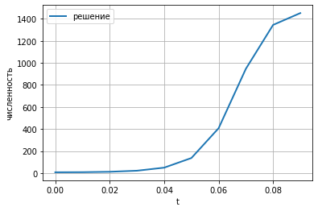

---
# Front matter
lang: ru-RU
title: "Отчет по лабораторной работе №7 "

subtitle: "Эффективность рекламы "

author: "Миличевич Александра, НПИ-02-18"


 
# Formatting
toc-title: "Содержание"
toc: true # Table of contents
toc_depth: 2
lof: true # List of figures
lot: true # List of tables
fontsize: 12pt
linestretch: 1.5
papersize: a4paper
documentclass: scrreprt
polyglossia-lang: russian
polyglossia-otherlangs: english
mainfont: PT Serif
romanfont: PT Serif
sansfont: PT Sans
monofont: PT Mono
mainfontoptions: Ligatures=TeX
romanfontoptions: Ligatures=TeX
sansfontoptions: Ligatures=TeX,Scale=MatchLowercase
monofontoptions: Scale=MatchLowercase
indent: true
pdf-engine: lualatex
header-includes:
  - \linepenalty=10 # the penalty added to the badness of each line within a paragraph (no associated penalty node) Increasing the value makes tex try to have fewer lines in the paragraph.
  - \interlinepenalty=0 # value of the penalty (node) added after each line of a paragraph.
  - \hyphenpenalty=50 # the penalty for line breaking at an automatically inserted hyphen
  - \exhyphenpenalty=50 # the penalty for line breaking at an explicit hyphen
  - \binoppenalty=700 # the penalty for breaking a line at a binary operator
  - \relpenalty=500 # the penalty for breaking a line at a relation
  - \clubpenalty=150 # extra penalty for breaking after first line of a paragraph
  - \widowpenalty=150 # extra penalty for breaking before last line of a paragraph
  - \displaywidowpenalty=50 # extra penalty for breaking before last line before a display math
  - \brokenpenalty=100 # extra penalty for page breaking after a hyphenated line
  - \predisplaypenalty=10000 # penalty for breaking before a display
  - \postdisplaypenalty=0 # penalty for breaking after a display
  - \floatingpenalty = 20000 # penalty for splitting an insertion (can only be split footnote in standard LaTeX)
  - \raggedbottom # or \flushbottom
  - \usepackage{float} # keep figures where there are in the text
  - \floatplacement{figure}{H} # keep figures where there are in the text
---

# Цель работы

Изучить модель рекламной компании

# Задание
**Вариант 27**

Организуется рекламная кампания нового товара или услуги. Необходимо,
чтобы прибыль будущих продаж с избытком покрывала издержки на рекламу.
Вначале расходы могут превышать прибыль, поскольку лишь малая часть
потенциальных покупателей будет информирована о новинке. Затем, при
увеличении числа продаж, возрастает и прибыль, и, наконец, наступит момент,
когда рынок насытиться, и рекламировать товар станет бесполезным.
Предположим, что торговыми учреждениями реализуется некоторая
продукция, о которой в момент времени t из числа потенциальных покупателей
N знает лишь n покупателей. Для ускорения сбыта продукции запускается реклама
по радио, телевидению и других средств массовой информации. После запуска
рекламной кампании информация о продукции начнет распространяться среди
потенциальных покупателей путем общения друг с другом. Таким образом, после
запуска рекламных объявлений скорость изменения числа знающих о продукции
людей пропорциональна как числу знающих о товаре покупателей, так и числу
покупателей о нем не знающих

Модель рекламной кампании описывается следующими величинами.
Считаем, что $\frac{dn}{dt}$- скорость изменения со временем числа потребителей,
узнавших о товаре и готовых его купить, t - время, прошедшее с начала рекламной
кампании, *n(t)* - число уже информированных клиентов. Эта величина
пропорциональна числу покупателей, еще не знающих о нем, это описывается
следующим образом: 

a~1~(t)(N-n(t)) , где N - общее число потенциальных
платежеспособных покупателей, a~1~(t)> 0- характеризует интенсивность
рекламной кампании (зависит от затрат на рекламу в данный момент времени).
Помимо этого, узнавшие о товаре потребители также распространяют полученную
информацию среди потенциальных покупателей, не знающих о нем (в этом случае
работает т.н. сарафанное радио). Этот вклад в рекламу описывается величиной
, эта величина увеличивается с увеличением потребителей a~2~(t)n(t)(N-n(t))
узнавших о товаре. Математическая модель распространения рекламы описывается
уравнением:
$\frac{dn}{dt}$ = (a~1~(t) + a~2~(t)n(t))(N-n(t))

График решения уравнения модели Мальтуса(рис. -@fig:001).


{ #fig:001 width=70% }

В обратном случае, при a~1~(t) << a~2~(t) получаем уравнение логистической
кривой:

График логистической кривой(рис. -@fig:002).


{ #fig:002 width=70% }


# Выполнение лабораторной работы

## Постановка задачи

29 января в городе открылся новый салон красоты. Полагаем, что на момент
открытия о салоне знали N~0~ потенциальных клиентов. По маркетинговым
исследованиям известно, что в районе проживают N
потенциальных клиентов салона. Поэтому после открытия салона руководитель запускает активную
рекламную компанию. После этого скорость изменения числа знающих о салоне
пропорциональна как числу знающих о нем, так и числу не знаю о нем. 

1) Построить график распространения рекламы о салоне красоты
N~0~ и N задайте самостоятельно)

2)Сравнить эффективность рекламной кампании при a~1~(t) > a~2~(t) и a~1~(t) < a~2~(t)

3)Определить в какой момент времени эффективность рекламы будет иметь
максимально быстрый рост (на вашем примере).

4)Построить решение, если учитывать вклад только платной рекламы

5)Построить решение, если предположить, что информация о товаре
распространятся только путем «сарафанного радио», сравнить оба решения


Постройте график распространения рекламы, математическая модель которой описывается
следующим уравнением:

1) $\frac{dn}{dt}$ = (0.73 + 0.000013n(t)(N-n(t))

2) $\frac{dn}{dt}$ = (0.000013 + 0.73(t)(N-n(t))

3) $\frac{dn}{dt}$ = (0.55sin(t) +  0.33sin(t)n(t))(N-n(t))

При этом объем аудитории
N = 756, в начальный момент о товаре знает 17 человек. Для
случая 2 определите в какой момент времени скорость распространения рекламы будет
иметь максимальное значение.

**Код задачи**
````
import numpy as np
from scipy. integrate import odeint
import matplotlib.pyplot as plt
import math

t0 = 0
x0 = 7
N = 1471

a1 = 0.73
a2 = 0.000013

t = np.arange( t0, 12, 0.1)

def syst(dx, t):
    x = dx
    return (a1 +x*a2)*(N-x)


y = odeint(syst, x0, t)

fig1 = plt.figure(facecolor='white')
plt.plot(t, y, linewidth=2, label="решение")
plt.xlabel("t")
plt.ylabel("численность")
plt.grid(True)
plt.legend()
plt.show()
fig1.savefig('03.png', dpi = 600)

a1 = 0.000013
a2 = 0.73

t = np.arange( t0, 0.5, 0.01)

y = odeint(syst, x0, t)
dy = (a1 +y*a2)*(N-y)

fig2 = plt.figure(facecolor='white')
plt.plot(t, y, linewidth=2, label="решение")
plt.plot(t, dy, linewidth=2, label="производная")
plt.xlabel("t")
plt.ylabel("численность")
plt.grid(True)
plt.legend()
plt.show()
fig2.savefig('04.png', dpi = 600)

def a1(t): 
    a1 = 0.55*math.sin(t)
    return a1

def a2(t): 
    a2 = 0.33*math.sin(5*t)
    return a2

t = np.arange( t0, 0.1, 0.01)

def syst2(dx, t):
    x = dx
    return (a1(t) +x*a2(t))*(N-x)

y = odeint(syst2, x0, t)

fig3 = plt.figure(facecolor='white')
plt.plot(t, y, linewidth=2, label="решение")
plt.xlabel("t")
plt.ylabel("численность")
plt.grid(True)
plt.legend()
plt.show()
fig3.savefig('05.png', dpi = 600)
```


**Полученные графы**
График случая 1
(рис. -@fig:003).


{ #fig:003 width=70% }


График случая 2(рис. -@fig:004).


{ #fig:004 width=70% }


График случая 3(рис. -@fig:005).


{ #fig:005 width=70% }

# Выводы

В ходе выполнения лабораторной работы была изучена
модель эффективности рекламы и построены графики.