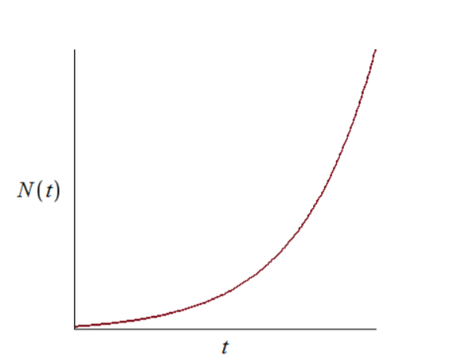
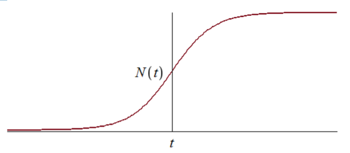
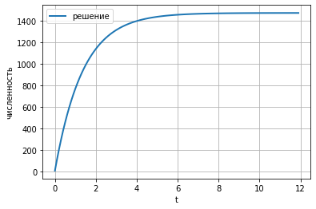
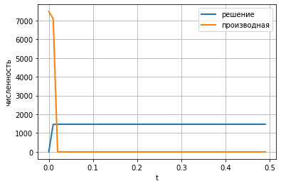
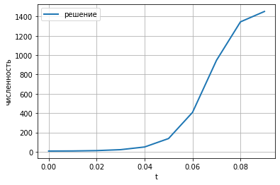

---
## Front matter
lang: ru-RU
title: Эффективность рекламы
author:  Миличевич Александра, НПИ 02-18
	
	
date: 13 March, 2021 Moscow, Russia

## Formatting
toc: false
slide_level: 2
theme: metropolis
header-includes: 
 - '\makeatletter'
 - '\makeatother'
aspectratio: 43
section-titles: true
---
# Цель работы
Изучить модель рекламной компании

# Задание к лабораторной
1) Построить график распространения рекламы о салоне красоты
N~0~ и N задайте самостоятельно)

2)Сравнить эффективность рекламной кампании при a~1~(t) > a~2~(t) и a~1~(t) < a~2~(t)

3)Определить в какой момент времени эффективность рекламы будет иметь
максимально быстрый рост (на вашем примере).

4)Построить решение, если учитывать вклад только платной рекламы

5)Построить решение, если предположить, что информация о товаре
распространятся только путем «сарафанного радио», сравнить оба решения

# Процес выполнения работы

dn /dt - скорость изменения со временем числа потребителей,
узнавших о товаре и готовых его купить,
t - время, прошедшее с начала рекламной кампании,
N - общее число потенциальных платежеспособных
покупателей,
n(t) - число уже информированных клиентов.

## Теоритическая часть

1. Величина n(t) пропорциональна числу покупателей, еще не
знающих о нем

2. a~1~ > 0 - характеризует интенсивность
рекламной кампании. Помимо этого, узнавшие о товаре
потребители также распространяют полученную
информацию среди потенциальных покупателей, не
знающих о нем. Этот вклад в рекламу описывается
величиной  a~2~(t)n(t))(N-n(t))
Эта величина увеличивается с увеличением потребителей узнавших о
товаре.

## Главное уравнение

Математическая модель распространения рекламы
описывается уравнением:

dn/ dt= (a~1~(t) + a~2~(t)n(t))(N-n(t))

График решения уравнения модели Мальтуса(рис. -@fig:001).

{ #fig:001 width=70% }

В обратном случае, при a~1~(t) << a~2~(t) получаем уравнение логистической
кривой:

График логистической кривой(рис. -@fig:002).

{ #fig:002 width=70% }

## Мой вариант

Постройте график распространения рекламы, математическая модель которой описывается
следующим уравнением:

dn/dt = (0.73 + 0.000013n(t)(N-n(t))

dn/dt = (0.000013 + 0.73(t)(N-n(t))

dn/dt = (0.55sin(t) +  0.33sin(t)n(t))(N-n(t))

При этом объем аудитории
N = 756, в начальный момент о товаре знает 17 человек. Для
случая 2 определите в какой момент времени скорость распространения рекламы будет
иметь максимальное значение.

# Графики

График случая 1
(рис. -@fig:003).

{ #fig:003 width=70% }

График случая 2(рис. -@fig:004).

{ #fig:004 width=70% }

График случая 3(рис. -@fig:005).

{ #fig:005 width=70% }

# Вывод

В ходе выполнения лабораторной работы была изучена
модель эффективности рекламы и построены графики.

## {.standout}

Спасибо за внимание 

